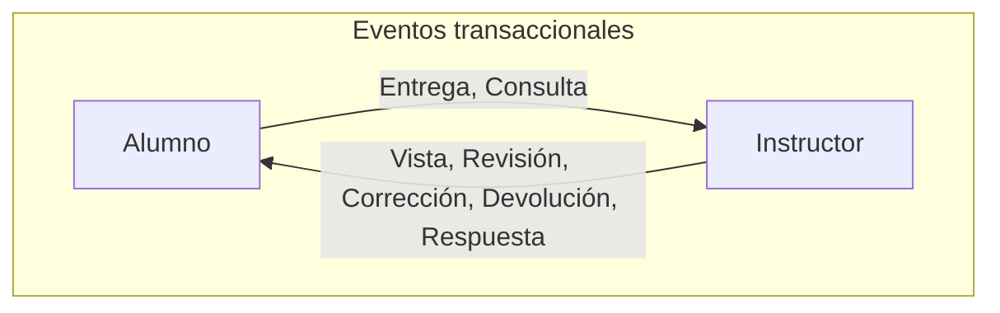
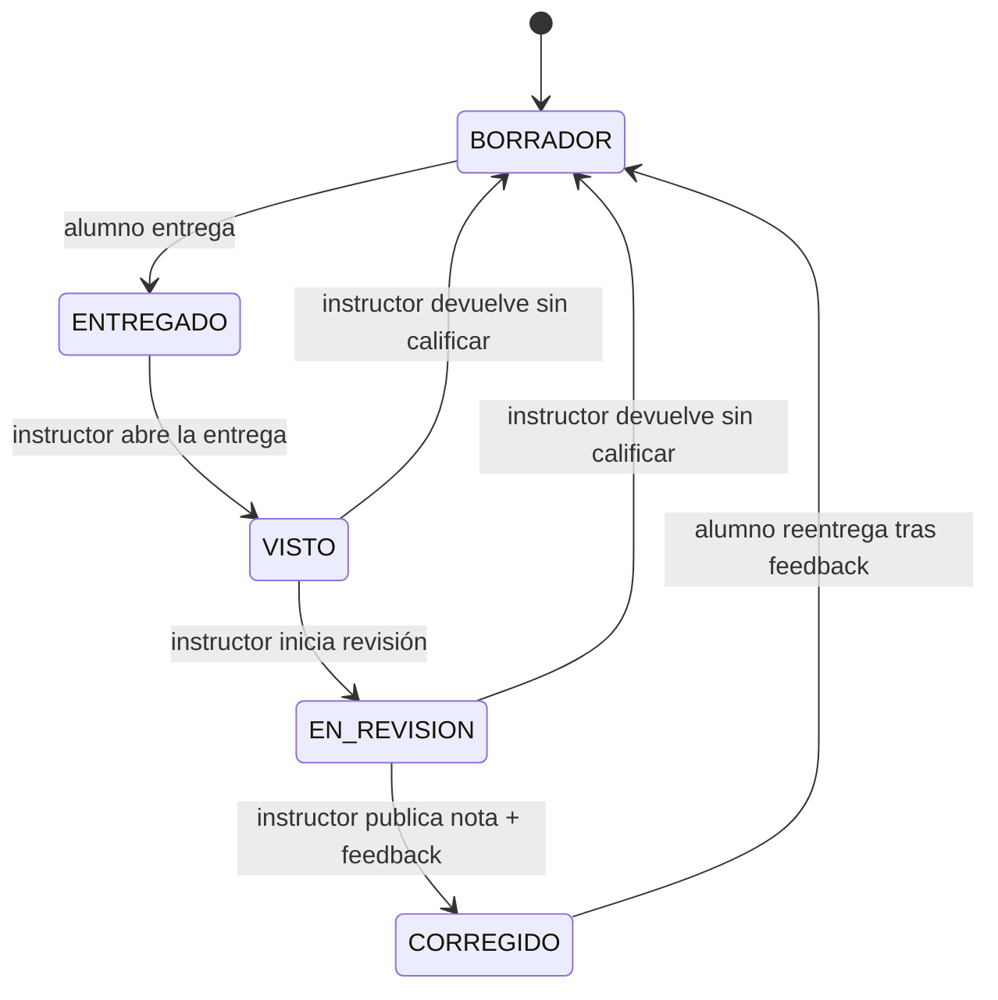
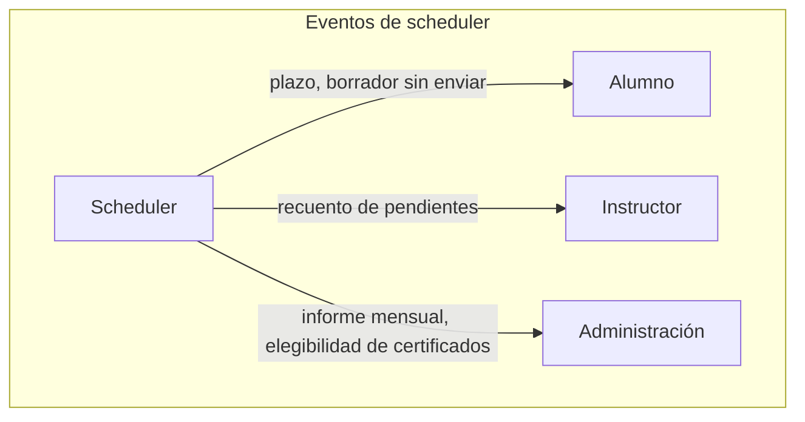

# Diseño de dominio

> Documento de trabajo. Punto de partida del diseño, sujeto a cambios a medida que se desarrolla.

## Contexto

API backend para una institución educativa (universitaria). Gestiona el ciclo de vida de entregas de ejercicios/correcciones/certificados de asignatura, con reacciones en tiempo real ante eventos del sistema, y procesos periódicos automatizados.

> Nota de alcance: "título" en este documento se refiere siempre a un **certificado de finalización por asignatura/módulo**, no a un título de carrera completa — eso último complicaría el dominio con conceptos (planes de estudio, requisitos entre asignaturas) que quedan fuera del alcance de este proyecto.

El reto de diseño no es el CRUD en sí — es decidir **qué reacciona a qué, cuándo debe ser inmediato y cuándo puede ser agregado**, y modelar eso con una arquitectura de eventos coherente en lugar de lógica condicional dispersa por el código.

Las decisiones técnicas que sostienen este dominio (mensajería, tiempo real, etc.) viven en [`02-architecture.md`](02-architecture.md).

## Actores

- **Alumno** — entrega ejercicios, consulta progreso y notas, plantea dudas. Matriculado en varias asignaturas a la vez, cada una con su propio grupo e instructor.
- **Instructor** — corrige entregas, gestiona sus grupos, responde consultas. Un instructor puede impartir varias asignaturas, y por tanto gestiona un grupo distinto por cada asignatura (no un único grupo fijo de alumnos).
- **Personal de Administración** — gestiona matriculaciones y permisos, supervisa informes agregados, valida emisión de certificados de asignatura
- **Sistema / Scheduler** — genera eventos automáticos basados en tiempo, no en una acción directa de un actor

## Principio de diseño: eventos transaccionales vs. eventos de scheduler

Distinción central del sistema, y la que más pesa en la arquitectura:

- **Eventos transaccionales**: los dispara una acción directa de un actor (Alumno o Instructor). Son la "conversación" natural entre ambos roles.
- **Eventos de scheduler**: los dispara el paso del tiempo (un proceso programado), no una persona. Tienen un destinatario y una cadencia propios según el rol.

Mezclar ambos tipos en el mismo flujo de código es un error común que delata diseño poco maduro. Aquí se modelan como productores de eventos distintos, y esa separación se refleja también en la estructura de paquetes ([`03-project-structure.md`](03-project-structure.md)).

Ciclo de vida de la entidad **Entrega**, incluyendo el atajo de devolución a borrador (descarte sin calificar, distinto de una corrección real):

## Casos de uso por actor

### Alumno
1. Crear un borrador de ejercicio (alta)
2. Modificar un borrador existente, antes de entregarlo
3. Borrar un borrador propio, antes de entregarlo
4. Entregar un ejercicio de un módulo (cierra el borrador y lo convierte en entrega formal) → dispara `EntregaRealizada`
5. Consultar el estado de sus entregas y el feedback recibido
6. Recibir notificación en tiempo real cuando su entrega es vista, corregida, o devuelta a borrador por el instructor
7. Solicitar/realizar una reentrega tras feedback
8. Plantear una consulta/duda a su instructor → dispara `ConsultaRealizada`
9. Recibir notificación cuando se le emite el certificado de una asignatura completada

### Instructor
10. Ver una entrega de uno de sus grupos (la apertura marca automáticamente como vista) → dispara `EntregaVista`
11. Marcar una entrega como "en revisión" (informa al alumno de que está siendo trabajada, aunque aún sin resolver) → dispara `RevisionIniciada`
12. Publicar una corrección con feedback → dispara `CorreccionPublicada`
13. Devolver una entrega a borrador, sin calificar, cuando el contenido es incorrecto o el alumno se ha confundido → dispara `EntregaDevueltaABorrador`
14. Recibir notificación en tiempo real de nuevas entregas, filtradas por la asignatura correspondiente
15. Recibir y responder consultas de alumnos de cualquiera de sus asignaturas → dispara `RespuestaConsultaPublicada`
16. Consultar su informe mensual, desglosado por asignatura (recuento de pendientes histórico y certificados emitidos por cada una)

### Personal de Administración
17. Dar de alta/baja alumnos e instructores, matricular alumnos en asignaturas y asignar instructor a cada grupo de asignatura
18. Consultar informe agregado de progreso por curso/asignatura
19. Configurar plazos de entrega por módulo (alimenta al Scheduler)
20. Recibir alerta cuando un grupo entero muestra inactividad anómala
21. Revisar candidatos a certificado de asignatura (`TituloElegibilidadDetectada`) y validar la emisión real (`TituloEmitido`)

### Sistema / Scheduler
22. Detectar alumnos sin actividad en X días → `InactividadDetectada`, notifica al instructor correspondiente
23. Detectar plazos de módulo vencidos sin entrega → notifica a alumno e instructor
24. Avisar de plazo por vencer (preventivo) → `PlazoPorVencer`, notifica al alumno
25. Detectar entregas abandonadas en borrador → `BorradorSinEnviarDetectado`, notifica al alumno
26. Generar recuento periódico de pendientes por instructor → `RecuentoPendientesActualizado`
27. Generar informe mensual agregado para Administración → `InformeMensualGenerado`
28. Detectar candidatos a certificado de asignatura mensualmente → `TituloElegibilidadDetectada`

## Catálogo de eventos

### Disparados por acción de un actor

| Evento | Disparado por | Notifica a |
|---|---|---|
| `EntregaRealizada` | Alumno | Instructor de esa asignatura (WebSocket) + actualización de dashboard |
| `EntregaVista` | Instructor (al abrir la entrega) | Actualización de dashboard del Alumno (no necesariamente push inmediato) |
| `RevisionIniciada` | Instructor | Alumno (WebSocket) — informativo: su entrega está en revisión, aún sin resolver |
| `CorreccionPublicada` | Instructor | Alumno (WebSocket) — nota + comentarios |
| `EntregaDevueltaABorrador` | Instructor | Alumno (WebSocket) — motivo del rechazo, sin nota |
| `ConsultaRealizada` | Alumno | Instructor (WebSocket) |
| `RespuestaConsultaPublicada` | Instructor | Alumno (WebSocket) |
| `TituloEmitido` | Administración (tras validar) | Alumno (WebSocket, aviso inmediato) + Alumno (email con PDF del certificado adjunto) + se acumula para informe mensual de Instructor |

### Disparados por el Scheduler (basados en tiempo)

| Evento | Cadencia | Notifica a |
|---|---|---|
| `PlazoPorVencer` | Preventivo, X horas/días antes | Alumno |
| `BorradorSinEnviarDetectado` | Periódico, cerca del plazo | Alumno |
| `InactividadDetectada` | Tras X días sin actividad | Instructor |
| `RecuentoPendientesActualizado` | Periódico | Instructor |
| `InformeMensualGenerado` | Mensual | Administración |
| `TituloElegibilidadDetectada` | Mensual | Administración |

## Entidades centrales (preliminar)

- **Asignatura** — entidad propia (no texto libre): id, nombre, código. Necesaria porque participa en lógica de negocio real, no solo visual — informes agregados (caso de uso 18), plazos configurables por módulo (caso de uso 19) y certificados (Título) todos referencian una Asignatura concreta, no una cadena de texto que podría escribirse de formas distintas.
- **GrupoAsignatura** — vincula una Asignatura con un Instructor (uno solo, sin co-docencia) y los Alumnos matriculados en ese grupo concreto. Es la entidad que resuelve "a qué grupo pertenece esta Entrega/Consulta", y la que permite que un Instructor tenga varios grupos (uno por asignatura que imparte) y un Alumno esté en varios grupos (uno por asignatura en la que está matriculado).
- **Alumno** — matriculado en uno o varios `GrupoAsignatura`. Tiene entregas, consultas y certificados asociados.
- **Instructor** — imparte una o varias asignaturas; por cada una gestiona un `GrupoAsignatura` (sin co-docencia: un único instructor por grupo). Recibe entregas y consultas de los alumnos de sus grupos.
- **Entrega** — pertenece a un Alumno, en el contexto de un `GrupoAsignatura` concreto; corregida por el Instructor de ese grupo. Estado: `BORRADOR (creación/edición/borrado libre) → ENTREGADO → VISTO → EN_REVISION → CORREGIDO → (REENTREGA_SOLICITADA → BORRADOR de nuevo)`. Desde `VISTO` o `EN_REVISION` (nunca desde `ENTREGADO` directamente, porque el instructor necesita haberla abierto/visto primero), puede devolver a `BORRADOR` sin pasar por `CORREGIDO` (caso de entrega incorrecta o confundida, sin calificación asociada).
- **Consulta** — vincula un Alumno con el Instructor del `GrupoAsignatura` correspondiente. Ciclo propio: `REALIZADA → RESPONDIDA`
- **Título** (certificado por asignatura) — vincula un Alumno con la Asignatura completada; validado por Administración. Ciclo propio: `ELEGIBILIDAD_DETECTADA → EMITIDO`. Se emite uno por cada asignatura/módulo que el alumno completa, no uno único de carrera. Al emitirse, se genera un PDF del certificado y se envía por email al alumno como adjunto, además del aviso WebSocket inmediato.

## Pendiente de decidir

- Modelo de permisos por rol (especialmente para Administración, que necesita vistas agregadas sin acceso al detalle de cada corrección)
- Si el proceso de título necesita un paso intermedio de revisión manual o se valida en bloque
- Si `EntregaVista` debe empujarse por WebSocket igual que el resto de eventos transaccionales, o si basta con que quede reflejado al consultar el dashboard (es una señal más débil que una corrección real, y empujarla en tiempo real podría ser ruido innecesario para el alumno)
- Si `EntregaDevueltaABorrador` debe llevar un motivo obligatorio (texto libre) para que el alumno entienda qué falló, o basta con el cambio de estado
- Qué librería de generación de PDF usar en Spring (ej. iText, Apache PDFBox, o plantilla HTML→PDF) y qué datos mínimos lleva el certificado (nombre, asignatura, fecha, posible firma/sello digital)
- Qué servicio de envío de email usar (SMTP propio vía Spring Mail, o un proveedor externo tipo SendGrid/Mailgun) y cómo manejar reintentos si el envío falla

## Decisiones cerradas (para no reabrir)

- **Sin co-docencia**: cada grupo de asignatura tiene un único instructor asignado. No existe el caso de "avisar a otro instructor del mismo grupo" porque esa figura no existe.
- **`RevisionIniciada` notifica al Alumno, no a otro instructor**: es informativo para que el alumno sepa que su entrega está siendo trabajada, sin necesidad de que exista un segundo instructor al que avisar.
- **Entidad `GrupoAsignatura` definida**: vincula Asignatura + Instructor (único) + Alumnos matriculados. Resuelve a qué grupo pertenece cada Entrega/Consulta/Título.