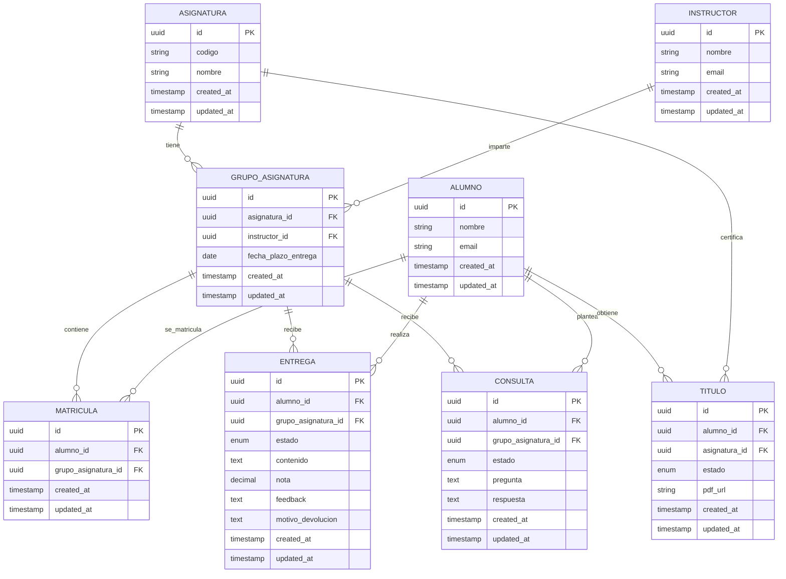

# Esquema de base de datos

> PostgreSQL, code-first vía JPA/Hibernate, migraciones versionadas con Flyway. Decisiones explicadas en [`02-architecture.md`](02-architecture.md). Entidades de negocio definidas en [`01-domain-design.md`](01-domain-design.md).

## Convenciones aplicadas a todas las tablas

- **Clave primaria**: `UUID`, generado en aplicación (no autoincremental) — ver justificación en `02-architecture.md`.
- **Auditoría**: todas las entidades llevan `created_at` y `updated_at` (`TIMESTAMP`), gestionados automáticamente por Hibernate (`@CreationTimestamp` / `@UpdateTimestamp`), no por el código de negocio.
- **Estados**: los campos de estado (Entrega, Título) usan tipos `ENUM` nativos de PostgreSQL, no `VARCHAR` — ver justificación en `02-architecture.md`.

## Diagrama ER

## Notas de diseño por tabla

### `grupo_asignatura`
Entidad puente entre Asignatura e Instructor, definida en el dominio para resolver "a qué grupo pertenece esta Entrega/Consulta". Lleva `fecha_plazo_entrega` porque es donde Administración configura el plazo (caso de uso 19) que alimenta al Scheduler.

> Pendiente: si una asignatura puede tener varios módulos/plazos distintos dentro del mismo grupo (varias entregas con fechas diferentes), `fecha_plazo_entrega` debería vivir en una tabla `modulo` aparte, no en `grupo_asignatura` directamente. Tal y como está ahora, asume un plazo único por grupo — revisar si el dominio real necesita más granularidad.

### `matricula`
Tabla de relación muchos-a-muchos entre Alumno y GrupoAsignatura (un alumno está en varios grupos, un grupo tiene varios alumnos). Sin esta tabla intermedia, no se puede modelar la matriculación.

### `entrega`
Columnas `nota`, `feedback` y `motivo_devolucion` son nullable — una Entrega en `BORRADOR` no tiene nota ni feedback todavía; una devuelta a borrador puede tener `motivo_devolucion` pero no `nota`. El enum `estado` cubre: `BORRADOR, ENTREGADO, VISTO, EN_REVISION, CORREGIDO`.

> Pendiente (heredado de `01-domain-design.md`): si `motivo_devolucion` debe ser obligatorio a nivel de validación de aplicación cuando el estado pasa a `BORRADOR` desde una devolución, aunque la columna en sí sea nullable a nivel de BD.

### `consulta`
`respuesta` es nullable mientras el estado es `REALIZADA`; se rellena al pasar a `RESPONDIDA`. El enum `estado` cubre: `REALIZADA, RESPONDIDA`.

### `titulo`
`pdf_url` es nullable mientras el estado es `ELEGIBILIDAD_DETECTADA` — solo existe el documento una vez se emite (`EMITIDO`). El enum `estado` cubre: `ELEGIBILIDAD_DETECTADA, EMITIDO`. Relaciona Alumno + Asignatura directamente (no a través de GrupoAsignatura), porque el certificado pertenece a la asignatura en sí, no a un grupo concreto de un curso académico determinado.

> Pendiente: si un alumno repite una asignatura (la cursa en dos grupos distintos en momentos distintos), ¿puede haber dos filas de `Titulo` para la misma pareja Alumno-Asignatura, o el certificado es único por alumno+asignatura para siempre? Afecta a si hace falta una restricción `UNIQUE(alumno_id, asignatura_id)`.

## Pendiente de decidir

- Granularidad de plazos: si `fecha_plazo_entrega` necesita vivir en una tabla `modulo` separada de `grupo_asignatura` (ver nota arriba)
- Restricción de unicidad en `titulo` para el caso de asignaturas repetidas
- Si la relación entre `entrega`/`consulta` y `grupo_asignatura` necesita un índice compuesto pensando en las consultas más frecuentes (ej. "todas las entregas pendientes de un instructor") una vez se conozcan los patrones de acceso reales