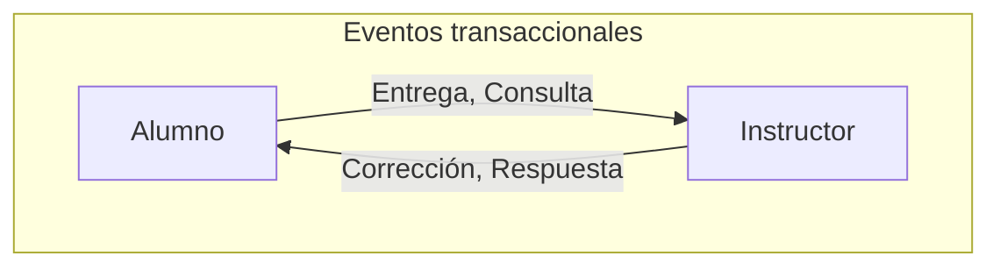
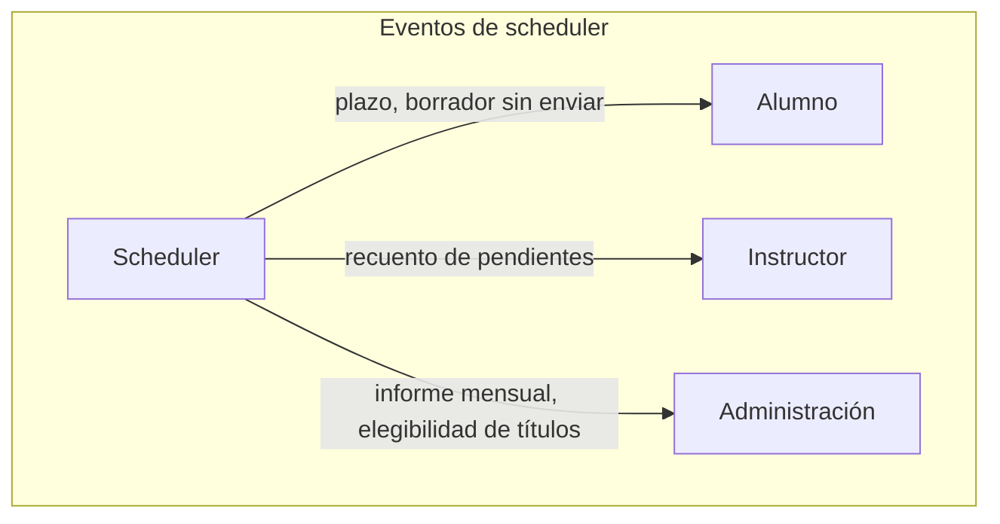

# Diseño — Sistema de seguimiento de progreso con eventos en tiempo real

> Documento de trabajo. Punto de partida del diseño, sujeto a cambios a medida que se desarrolla.

## Contexto

API backend para una institución educativa (universitaria). Gestiona el ciclo de vida de entregas de ejercicios/corecciones/titulaciones, con reacciones en tiempo real ante eventos del sistema, y procesos periódicos automatizados.

El reto de diseño no es el CRUD en sí — es decidir **qué reacciona a qué, cuándo debe ser inmediato y cuándo puede ser agregado**, y modelar eso con una arquitectura de eventos coherente en lugar de lógica condicional dispersa por el código, de manera eficiente y coherente con la tecnología actual.

## Decisiones de arquitectura

| Decisión | Elegido | Alternativa descartada | Por qué |
|---|---|---|---|
| Mensajería entre eventos | RabbitMQ | Event Bus interno de Spring (`ApplicationEventPublisher`) | El bus interno es síncrono y vive solo dentro del proceso: si el servicio cae, los eventos pendientes se pierden, y no escala a varias instancias. RabbitMQ persiste mensajes y permite crecer a varios servicios sin rediseñar nada. |
| Mensajería entre eventos | RabbitMQ | Kafka | Kafka está pensado para volúmenes y streaming que este dominio no tiene. Usarlo aquí sería sobre-ingeniería. |
| Tiempo real hacia el cliente | WebSockets | Server-Sent Events (SSE) | SSE es unidireccional (servidor→cliente). Aquí hace falta bidireccionalidad real: ej. un instructor marca "revisando ahora" para evitar que otro instructor duplique trabajo. |
| Notificaciones a Instructor sobre títulos | Informe mensual agregado | Notificación individual por título emitido | No todo evento necesita ser en tiempo real. Saber cuándo *no* usar push inmediato es tan parte del diseño como saber cuándo sí. |

## Actores

- **Alumno** — entrega ejercicios, consulta progreso y notas, plantea dudas
- **Instructor** — corrige entregas, gestiona su grupo, responde consultas
- **Personal de Administración** — gestiona matriculaciones y permisos, supervisa informes agregados, valida emisión de títulos
- **Sistema / Scheduler** — genera eventos automáticos basados en tiempo, no en una acción directa de un actor

## Principio de diseño: eventos transaccionales vs. eventos de scheduler

Distinción central del sistema, y la que más pesa en la arquitectura:

- **Eventos transaccionales**: los dispara una acción directa de un actor (Alumno o Instructor). Son la "conversación" natural entre ambos roles.
- **Eventos de scheduler**: los dispara el paso del tiempo (un proceso programado), no una persona. Tienen un destinatario y una cadencia propios según el rol.

Mezclar ambos tipos en el mismo flujo de código es un error común que delata diseño poco maduro. Aquí se modelan como productores de eventos distintos.

## Casos de uso por actor

### Alumno
1. Entregar un ejercicio de un módulo → dispara `EntregaRealizada`
2. Consultar el estado de sus entregas y el feedback recibido
3. Recibir notificación en tiempo real cuando su entrega es corregida
4. Solicitar/realizar una reentrega tras feedback
5. Plantear una consulta/duda a su instructor → dispara `ConsultaRealizada`
6. Recibir notificación cuando su título es emitido

### Instructor
7. Ver entregas pendientes de corregir de su grupo asignado
8. Marcar una entrega como "en revisión" (evita duplicar trabajo con otro instructor) → dispara `RevisionIniciada`
9. Publicar una corrección con feedback → dispara `CorreccionPublicada`
10. Recibir notificación en tiempo real de nuevas entregas de su grupo
11. Recibir y responder consultas de alumnos → dispara `RespuestaConsultaPublicada`
12. Consultar su informe mensual (incluye recuento de pendientes histórico y títulos emitidos a sus alumnos)

### Personal de Administración
13. Dar de alta/baja alumnos e instructores, asignar alumnos a grupos/instructores
14. Consultar informe agregado de progreso por curso/módulo
15. Configurar plazos de entrega por módulo (alimenta al Scheduler)
16. Recibir alerta cuando un grupo entero muestra inactividad anómala
17. Revisar candidatos a título (`TituloElegibilidadDetectada`) y validar la emisión real (`TituloEmitido`)

### Sistema / Scheduler
18. Detectar alumnos sin actividad en X días → `InactividadDetectada`, notifica al instructor correspondiente
19. Detectar plazos de módulo vencidos sin entrega → notifica a alumno e instructor
20. Avisar de plazo por vencer (preventivo) → `PlazoPorVencer`, notifica al alumno
21. Detectar entregas abandonadas en borrador → `BorradorSinEnviarDetectado`, notifica al alumno
22. Generar recuento periódico de pendientes por instructor → `RecuentoPendientesActualizado`
23. Generar informe mensual agregado para Administración → `InformeMensualGenerado`
24. Detectar candidatos a título mensualmente → `TituloElegibilidadDetectada`

## Catálogo de eventos

### Disparados por acción de un actor

| Evento | Disparado por | Notifica a |
|---|---|---|
| `EntregaRealizada` | Alumno | Instructor (WebSocket) + actualización de dashboard |
| `RevisionIniciada` | Instructor | Otros instructores del mismo grupo (WebSocket) |
| `CorreccionPublicada` | Instructor | Alumno (WebSocket) — nota + comentarios |
| `ConsultaRealizada` | Alumno | Instructor (WebSocket) |
| `RespuestaConsultaPublicada` | Instructor | Alumno (WebSocket) |
| `TituloEmitido` | Administración (tras validar) | Alumno (WebSocket) + se acumula para informe mensual de Instructor |

### Disparados por el Scheduler (basados en tiempo)

| Evento | Cadencia | Notifica a |
|---|---|---|
| `PlazoPorVencer` | Preventivo, X horas/días antes | Alumno |
| `BorradorSinEnviarDetectado` | Periódico, cerca del plazo | Alumno |
| `InactividadDetectada` | Tras X días sin actividad | Instructor |
| `RecuentoPendientesActualizado` | Periódico | Instructor |
| `InformeMensualGenerado` | Mensual | Administración |
| `TituloElegibilidadDetectada` | Mensual | Administración |

## Entidades centrales (preliminar)

- **Entrega** — estado: `ENTREGADO → EN_REVISION → CORREGIDO → (REENTREGA_SOLICITADA → ENTREGADO)`
- **Consulta** — ciclo propio: `REALIZADA → RESPONDIDA`
- **Título** — ciclo propio: `ELEGIBILIDAD_DETECTADA → EMITIDO`

## Pendiente de decidir

- Estructura de módulos/paquetes en Spring que refleje esta separación transaccional/scheduler
- Modelo de permisos por rol (especialmente para Administración, que necesita vistas agregadas sin acceso al detalle de cada corrección)
- Si el proceso de título necesita un paso intermedio de revisión manual o se valida en bloque